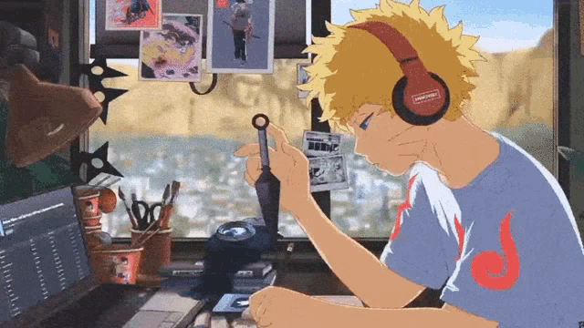

### Welcome! My name is Abel Mariano and I’m currently learning full stack web development 

- 🧑🏻‍💻 I am currently studying at Trybe 💚
- 🤝 I’m looking to collaborate on full stack projects
- 📫 How to reach me: abelwm25@gmail.com
- ⚡ Nice fact: I also like to manipulate images
 

### Reach me on:

  

  

 

### Fundamentals:

	
  
  
  
  
  
  
  
  
  
  

### Front-end:

	
  
  
  

### Languages and Tools:

 

